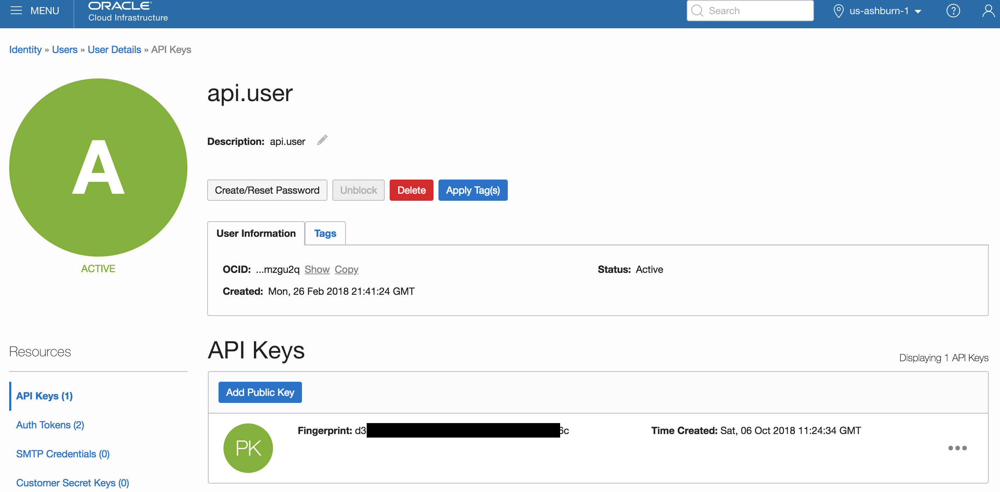
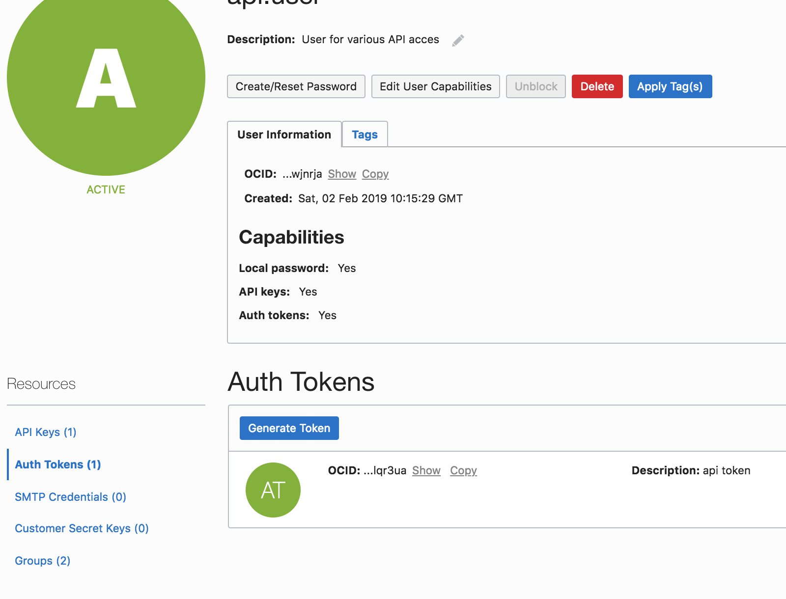
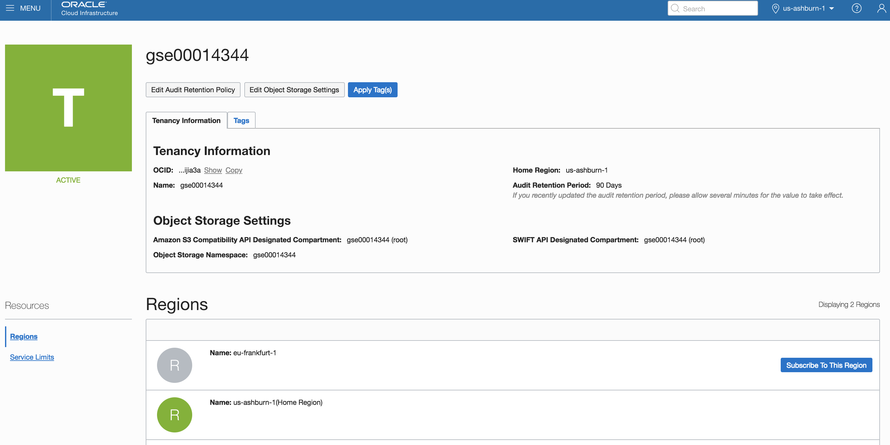
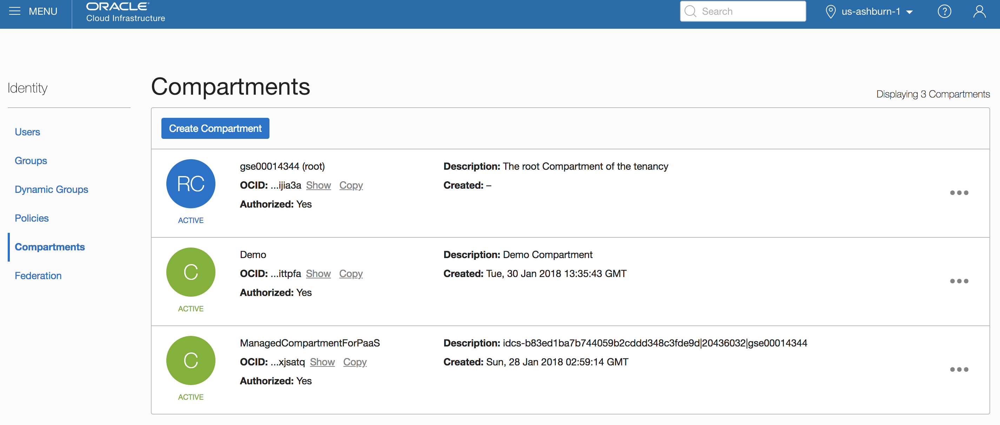
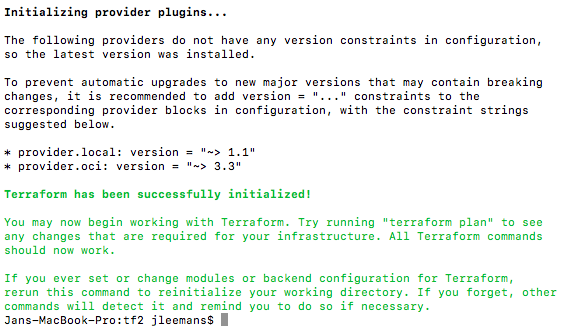
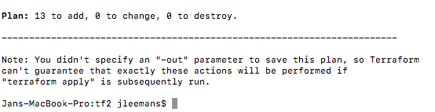

[Go to Overview Page](README.md)


# Microservices on ATP

## Part 6: Setup your Managed Kubernetes Instance

This Lab describes how to instantiate an **Oracle Managed Kubernetes cluster using Terraform**, including all the required network elements such as VNC's, subnets and access lists.
#### **Introduction**

In this lab we will perform the steps described below.  In case you are using an Instructor-provided instance, the first 2 steps will already have been performed, but you can check to see the exact setup in your instance :

- Define the OKE required Policies (allow service OKE to manage all-resources in tenancy)
- Create a non-SSO user with an API certificate and an Identity Token
- Open a command prompt on your local machine and navigate to the **terraform** folder in the ATPDocker git repository folder
- Edit the file terraform.tfvars and enter your instance OCID's on the first lines
- run ```terraform init``` , `terraform plan` and `terraform apply` to spin up your infrastructure
- validate the resulting K8S infrastructure via `kubectl`, using the file **mykubeconfig** that was created 

Below you find a detailed description of these steps, with screendumps and explanations where to find the various OCID's and how to install the required commands `terraform` and `kubectl` on your local machine.


### **STEP 1**: Add a Policy Statement for OKE

- If you are using an Instructor provided instance, this policy will already be defined.

- Before the Oracle managed Kubernetes service can create compute instances in your OCI tenancy, we must explicitly give it permission to do so using a policy statement. From the OCI Console navigation menu, choose **Identity->Policies**.

  [](https://github.com/CloudTestDrive/learning-library/blob/master/workshops/container-native-development-with-oke/images/200/LabGuide200-13c980fa.png)

- In the Compartment drop down menu on the left side, choose the **root compartment**. It will have the same name as your OCI tenancy (Cloud Account Name).

  [](https://github.com/CloudTestDrive/learning-library/blob/master/workshops/container-native-development-with-oke/images/200/LabGuide200-a321171a.png)

- Click **PSM-root-policy**

  [](https://github.com/CloudTestDrive/learning-library/blob/master/workshops/container-native-development-with-oke/images/200/LabGuide200-e67b7705.png)

- Click the **Add Policy Statement** button

  [](https://github.com/CloudTestDrive/learning-library/blob/master/workshops/container-native-development-with-oke/images/200/LabGuide200-3d4a7471.png)

- In the Statement box, enter: `allow service OKE to manage all-resources in tenancy` and click **Add Statement**

  [](https://github.com/CloudTestDrive/learning-library/blob/master/workshops/container-native-development-with-oke/images/200/LabGuide200-bd5bcbd1.png)


### STEP 2: Create an API user with a certificate

**ATTENTION** : if you are using an Instructor-provided instance, a user called **api.user** will already have been set up for you, and the keys, fingerprints and tokens of this user will be provided to you.

- Add an API (non-SSO) user with an API key:
  - Navigate to the "Identity" , "Users" screen and add a user called "api.user"
  - Add an API key: you need a private/public key pair, and you need to paste the public one into the key field. 

    - On a Mac : open a console window and execute following commands

    - ```
      mkdir ./mykey
      openssl genrsa -out ./mykey/api_key.pem 2048
      openssl rsa -pubout -in ./mykey/api_key.pem -out ./mykey/api_key_public.pem
      ```

    - On a Windows PC, you can use [puttygen](https://www.ssh.com/ssh/putty/download).exe to create a key.
  - Copy the fingerprint of your API key in a temporary file
  - Copy the OCID of this new user in a tempporary file


  


- Create an Auth Token for the user api.user

    - Take care to copy the Token string in a file on your PC : you will nbeed it later, and you cannot retrieve it back from the console.

        

    

### Step 3: Set up Terraform on your local machine

Terraform needs to be installed on your local machine.  

- Go to the [Hashicorp Terraform website](https://www.terraform.io/downloads.html) to download the software for your OS
- unzip the executable file in the directory of your choice
- Add the terraform command to your path
    - On Mac: export PATH=$PATH:`pwd`
    - On Windows: go to System Steetings, Advanced, Environment Variables, and add the path to your Terraform directory 


### Step 4: Collect Infrastructure Info for your environment: ###

You need to collect a series of OCID's from your instance in order for Terraform to access your instance:
- Tenancy OCID
- Region name
- Compartiment OCID
- User OCID
- API Key fingerprint
- Private key API local path


Screen shots of the various locations to find this information

- **Tenancy OCID** and **Region Name**:
  - Navigate to "Administration", "Tenancy Details"
  
  
- **Compartment OCID**
  - Navigate to "Identity", "Compartments"
  - Select the compartment where you want to create the cluser (for example "Demo")
  
  
- **User OCID** and **API Key Fingerprint**
  - Navigate to "Identity", "Users"
  - Select the user you created
  
  
- **Private Key API Path**
  - This is the local path on your laptop where the private key file is located


### Step 5: Set the Terraform parameters and run the script ###

- Open a command prompt on your local machine and navigate to the **terraform** folder in the ATPDocker git repository folder

- Edit the file terraform.tfvars and enter your instance OCID's on the first lines, using the information collected in the previous section

- Now edit the file **k8s.tf** and add your initials to the **name** of the kubernetes cluster:

   ```
   resource "oci_containerengine_cluster" "k8s_cluster" {
   	compartment_id = "${var.compartment_ocid}"
   	kubernetes_version = "v1.12.6"
   	name = "k8s_cluster_atp_myInitials"
   	vcn_id = "${oci_core_virtual_network.K8SVNC.id}"
   ```

- Edit the file **network.tf** and do the same for the **display_name** of the Virtual Network:

```
resource "oci_core_virtual_network" "K8SVNC" {
  cidr_block     = "${var.VPC-CIDR}"
  compartment_id = "${var.compartment_ocid}"
  display_name   = "K8S-VNC-ATP-MyInitials"
  dns_label      = "k8s"
}
```


- Run `terraform init` in this directory, all dependencies, including oci v3 should download
- 
- run `terraform plan` to validate your config

   - You should see 13 objects to be created

   - 
   - **Attention:** you might get an error on the version of your kubernetes cluster.  The version of Kubernetes specified in the file "k8s.ft" might be a too old version as compared to the versions made available by the OKE service.  If you encounter this error, verify the available versions on the OKE console that are available.
- run `terraform apply` to spin up your infrastructure

   - 

   - type "yes"
- In case you do not have kubectl installed on your machine, follow these steps:

   - [Instructions to Install kubectl](https://github.com/CloudTestDrive/EventLabs/blob/master/AppDev/K8S/kubectl_install.md)


### Step 6: Validate and connect to the Kubernetes cluster

- In case you do not have kubectl installed on your machine, follow these steps:

   - [Instructions to Install kubectl](https://github.com/CloudTestDrive/EventLabs/blob/master/AppDev/K8S/kubectl_install.md)

- validate the resulting K8S infrastructure :

   - ```bash
     export KUBECONFIG=./mykubeconfig
     kubectl version
     kubectl get nodes
     ```

   - If you execute the last command immediately after the creation of the cluster, you might get the following result:

      - ```
         No resources found.
         ```

   - In that case, wait a few minutes, you can re-execute the **get nodes** command untill you see something like the below:

      - ```
         NAME        STATUS   ROLES   AGE   VERSION
         10.0.10.2   Ready    node    23s   v1.12.6
         10.0.11.2   Ready    node    30s   v1.12.6
         10.0.12.2   Ready    node    14s   v1.12.6
         ```

         

- To access the Kubernetes console:

   - ```
     kubectl proxy
     ```

     

   - Then navigate in a browser to the following address:   
     http://localhost:8001/api/v1/namespaces/kube-system/services/https:kubernetes-dashboard:/proxy/#!/login


- Set up a "Secret" to allow you to pull images from your private repository:

  - Run the following command, where you need to insert your specific parameters:

    ```bash
    kubectl create secret docker-registry ocirsecret
    --docker-server=<region-code>.ocir.io --docker-username='<tenancy-name>/<oci-username>' --docker-password='<oci-auth-token>' --docker-email='<email-address>'
    ```

    - **region-code** is for example **fra** for Frankfurt, **iad** for Ashburn, etc.  See [here](https://docs.cloud.oracle.com/iaas/Content/Registry/Concepts/registryprerequisites.htm#Availab) for details.
    - **tenancy-name** is the name of your Cloud tenancy
    - **oci-username** is the name of the **api.user** you just created
    - **oci-auth-token** is the **Auth Token** you just created and noted down
    - **email-address** is mandatory but not used, can be jdoe@acme.com

  - Example command:

    ```bash
    kubectl create secret docker-registry ocirsecret --docker-server=fra.ocir.io --docker-username='mytenancy/api.user' --docker-password='k]j64r{1sJSSF-;)K8' --docker-email='jdoe@acme.com'
    ```

    The result should be 

    ```
    secret/ocirsecret created
    ```

    


---

[Go to Overview Page](README.md)