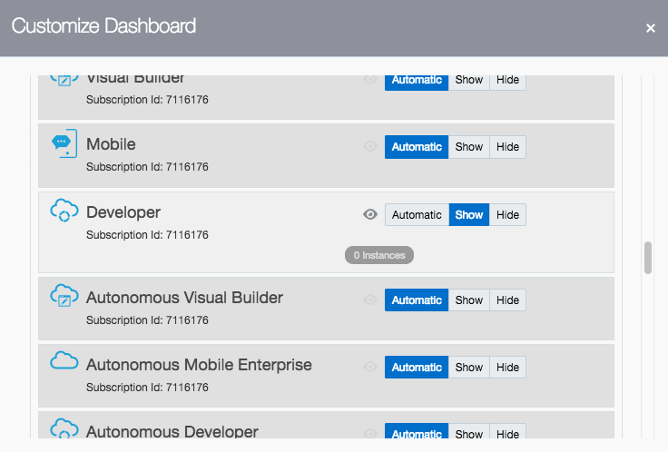
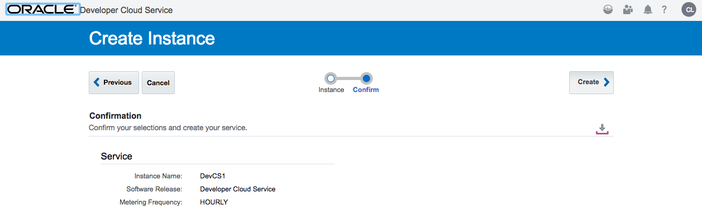
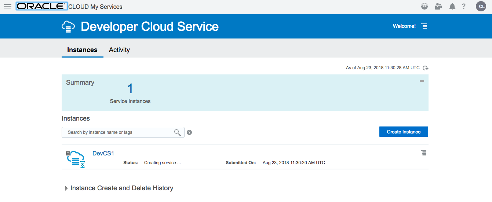
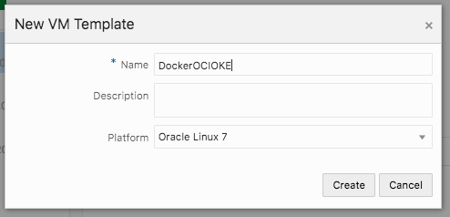
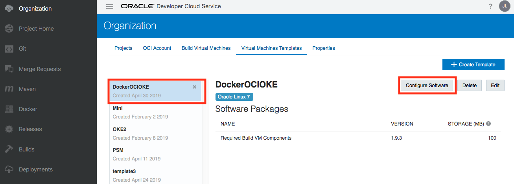
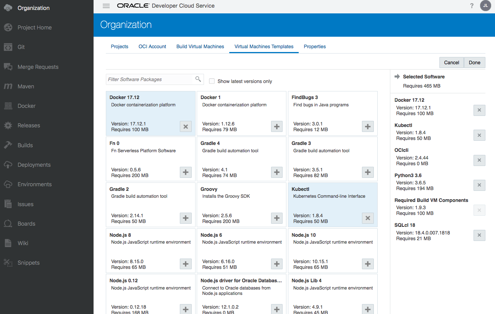
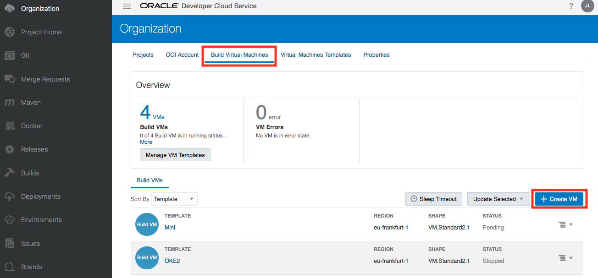
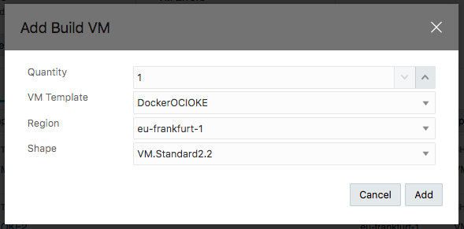

[Go to Overview Page](README.md)

# AppDev Development - Building applications with DevOps #
## Setup your Developer Cloud Service Instance ##

## Introduction ##

This page will guide you through the setup of a new Developer Cloud instance :
- Enabling DevCS on your Dashboard
- Creating an instance
- Configuring the storage and Build parameters for your instance

This guide is meant for new Developer Cloud Service instances (post June 2018) cloud environments

**ATTENTION** : if you are running this lab in a **Instructor-provided environment**, your Developer Cloud instance has already been created, **you can skip the steps on this page**.  A link to the instance will be provided by your instructor.

### Enable DevCS on your dashboard ###

- Login to your cloud account and navigate to the dashboard

- Make sure the "Developer Cloud" service is "visible" on the dashboard as in the above screenshot.  If this is not the case, use the "Customize Dashboard" button to enable it.

### Create an instance ###

- Go into the Developer Cloud Service Overview by clicking on the Service title

- Open the Service Console.  You should have no existing instances.  If you have, you can skip the following steps and just validate you have a build engine witht the correct libraries included.

- Use the "Create Instance" button to create a new Developer Cloud instance

- Hit the "Next" button and then "Create"

- Now the instance is being created.  This will take a few minutes, you can hit the small arrow to requery the status.

### Configuring your DevCS Instance ###

Once the instance is available, you need to configure a few things to be able to create projects and run builds:

- Create a dedicated user with specific privileges
- Add a public key to the user profile
- Create a group for DevCS users
- Add a DevCS policy in the **root** compartment
- Then configure the OCI connection using the references to these OCI objects you just created.

You will use the **OCI** type of setup, please ignore the *OCI Classic* setup instructions.

A detailed explanation of these steps is provided in [this section of the Developer Cloud Documentation](https://docs.oracle.com/en/cloud/paas/developer-cloud/csdcs/service-setup.html#GUID-0FCE0C4F-75F4-43BC-8699-EBE039DA5E7A).  Navigate to that page, then use the **Back** button of your browser to returrn to this location.

### Creating a Virtual Machine

- On the left-side menu, select the top level **Organization** menu, then click on **Virtual Machines Templates** in the top menu.  Next you can hit the **Create Template** button.

- In the dialog box, specify a name, for example **DockerOCIOKE**  and use the default **Oracle Linux 7** image.  Then hit the **Create** button.

  

- Now select the template you just created (DockerOCIOKE), and add the required software packages by clicking on the **Configure Software** button.

- Select the following packages:
  - Docker 17,2
  - Kubectl
  - OCIcli ==> this will prompt you to also install Python3
  - SQLcl 18

- Finally, navigate to the **Build Virtual Machines** menu on the top menu, and hit the **+ Create VM** button.

  

  
  
  In the dialog that pops up, enter following values:
  
  - Choose **Quantity = 1**
  
  - Select the **VM Template** you just created: **DockerOCIOKE**
  
  - Set the **Region** to **eu-Frankfurt-1**
  
  - Select the compute **Shape** : **VM.Standard2.2**
  
    

You finished all the steps to finalize the Developer Cloud setup.  Please use the "Back" button of your browser to return to the main tutorial.

 

---

[Go to Overview Page](README.md)

